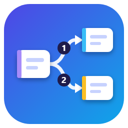
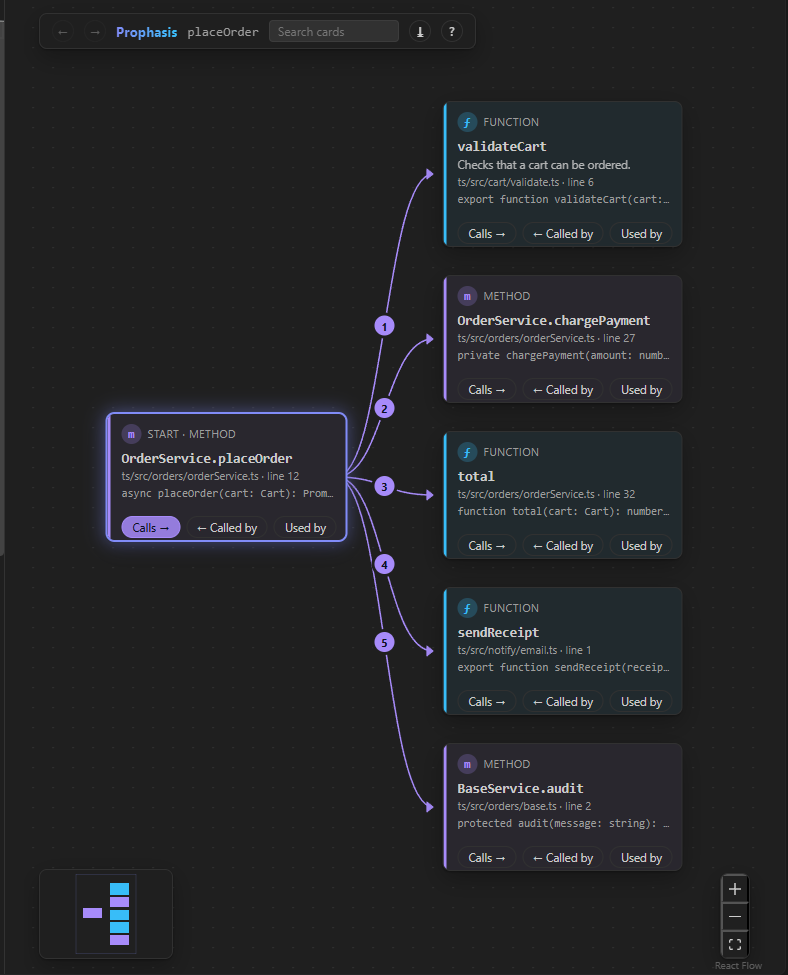
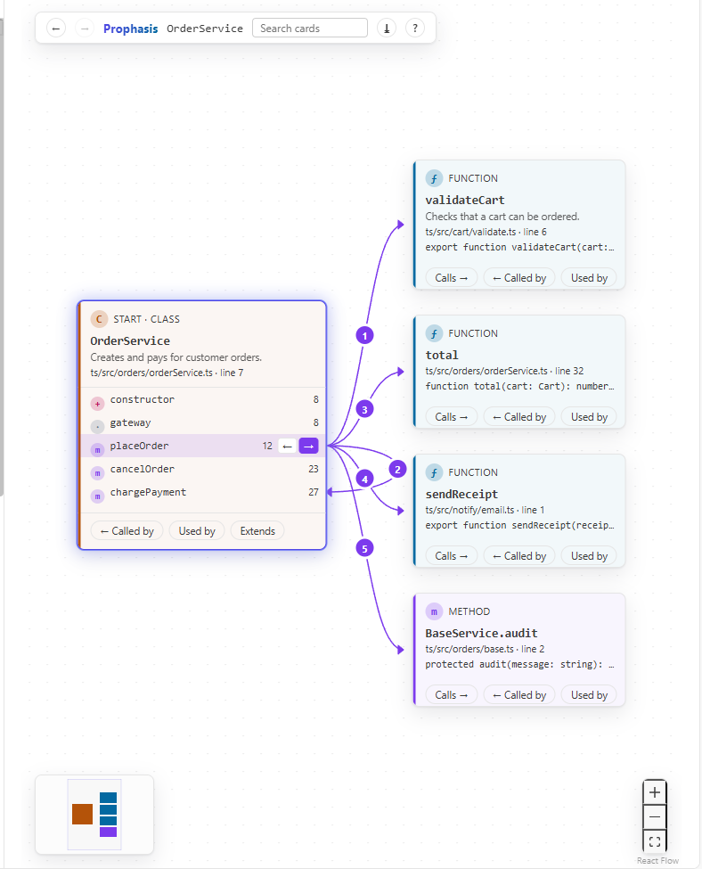
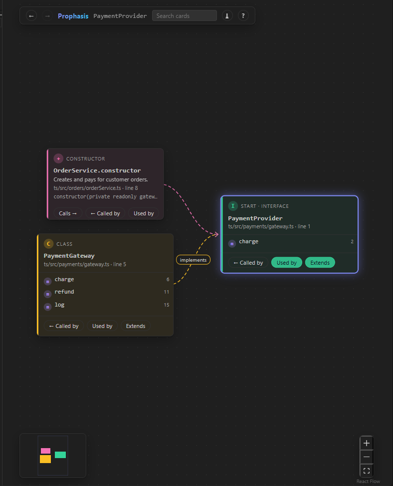
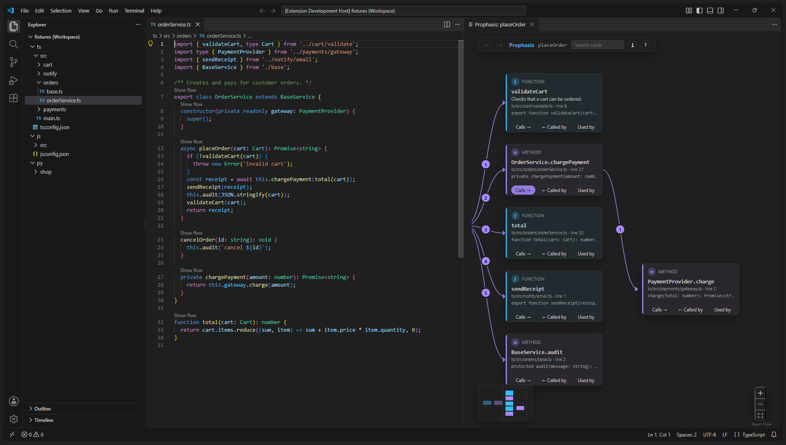

<p align="center">
  
</p>

<h1 align="center">Prophasis</h1>

<p align="center">
  <b>See how your code connects.</b> Click a function, method or class and Prophasis draws it as a
  card, with numbered arrows to what it calls, what calls it, what uses it and what it extends.
  Expand any card, in any direction, one step at a time.
</p>

<p align="center">
  <a href="https://github.com/HasnainBilash/prophasis/actions/workflows/ci.yml"></a>
</p>

<p align="center">
  
</p>

## Why

To understand one function you usually jump between files and keep the chain in your head.
VS Code's **Show Call Hierarchy** gives you a list; Prophasis gives you the shape: cards you can
expand in any direction, arrows numbered in the order the calls are written, and class cards whose
arrows leave from the exact method.

## Features

- **Start anywhere.** A **Show flow** button above every function, method and class. Or right-click
  inside one, press **Ctrl+Shift+Alt+F** (**Cmd+Shift+Alt+F** on a Mac), or use the Command Palette.
- **Explore in any direction.** Every card has **Calls →**, **← Called by** and **Used by**; class
  cards add **Extends** (parents and children in Python, children in TypeScript and JavaScript).
  Click a lit button again to hide what it showed.
- **Read the shape at a glance.** Arrows are numbered in the order the calls are written. Class
  cards list their members, and arrows leave from the exact member row. Recursion is marked, not
  drawn forever. Library code is hidden unless you ask for it.
- **Stays readable.** One expansion adds at most 12 cards plus a "+N more" card. Hover a card to
  light up its flow. Search, a minimap, **← →** history between starting points, and keyboard
  navigation (Tab to a card, arrow keys to move, Enter to open the code).
- **Click a card to open its code**, with the name selected.
- **✦ Explain** a card in plain language, or right-click a card and choose **Explain path from
  start to here**. Uses GitHub Copilot through VS Code (the free plan works); asks before sending
  anything.
- **Copy as Mermaid** (⤓) to paste the graph into a Markdown file, a GitHub comment or docs.
- **Looks native.** Follows your theme, light, dark and High Contrast, with a colour per kind that
  passes WCAG contrast checks.

|                                                   Classes, in a light theme                                                    |                                                       Uses and types                                                        |
| :----------------------------------------------------------------------------------------------------------------------------: | :-------------------------------------------------------------------------------------------------------------------------: |
|  |  |



## Getting started

1. Install Prophasis, open a TypeScript, JavaScript or Python project, and open a file.
2. Click **Show flow** above a function.
3. Click **Calls →** or **← Called by** on any card to keep going.

VS Code's Welcome page also has a short **Get started with Prophasis** walkthrough.

**Languages.** Prophasis asks VS Code the same questions as the built-in Show Call Hierarchy, and
the language's extension answers. TypeScript, JavaScript and Python (Pylance) are tested; any
language whose extension provides call hierarchy should work. If one doesn't, Prophasis says so.

## Settings

| Setting                           | Default | What it does                                  |
| --------------------------------- | ------- | --------------------------------------------- |
| `prophasis.defaultDepth`          | 1       | Levels of calls loaded when a graph opens     |
| `prophasis.maxCards`              | 150     | Most cards shown at once                      |
| `prophasis.showExternalCode`      | false   | Include library and standard-library calls    |
| `prophasis.excludeGlobs`          | []      | File patterns to leave out, e.g. `**/test/**` |
| `prophasis.explain.includeBodies` | false   | Explain on a class: send method bodies too    |
| `prophasis.explain.maxCharacters` | 12000   | Most code characters sent per Explain         |

## Honest limits

- **It shows what the language server knows.** Dynamic calls (`handlers[name]()`), callbacks,
  `eval`, reflection, dependency injection, decorators and framework wiring are often invisible.
- **Calls through an interface** point at the interface, not the class that runs.
- **Arrow numbers are written order, not run-time order.** A call inside an `if` may never run.
- **"Used by"** can't tell `new Foo()` from a type annotation, and leaves out references outside
  any function or class (imports, top-level code).
- **Extends** in TypeScript and JavaScript shows child types only; their language service has no
  type hierarchy.
- **Explanations can be wrong.** They are based only on the code that was sent, and need GitHub
  Copilot access.
- Not tested in VS Code for the Web, Remote-SSH, WSL or Dev Containers.

## Privacy and security

- No telemetry, no server, no accounts. Prophasis only reads your code, through VS Code.
- **Explain** is the only feature that sends code anywhere: only after you agree, only the code you
  chose (12,000 characters at most), to the model VS Code provides. Answers are kept in memory,
  never on disk. Explain is off in untrusted workspaces.
- The panel runs under a strict Content Security Policy (only its own script, nothing remote), and
  every message between the panel and the extension is validated in both directions.
- Problems are logged, one structured line each, to **View → Output → Prophasis** (never code
  contents).

## Performance

Measured in a real VS Code; details in [docs/PLAN.md](docs/PLAN.md#5-performance-targets-and-measurements).

| Action                             | Target       | Measured                          |
| ---------------------------------- | ------------ | --------------------------------- |
| Activation                         | under 200 ms | about 1 ms                        |
| First graph, language server ready | under 1.5 s  | 13 to 157 ms median, 695 ms worst |
| Expanding one card                 | under 1 s    | 3 to 34 ms median, 394 ms worst   |
| Laying out 150 cards               | under 300 ms | 106 ms                            |

Measured on a generated 1,000-function project and on two real projects (immer, requests).

## How it's built

| Part         | Choice                                                                                     |
| ------------ | ------------------------------------------------------------------------------------------ |
| Language     | TypeScript (strict)                                                                        |
| Code facts   | VS Code's built-in commands: call hierarchy, symbols, references, type hierarchy, hover    |
| Panel        | React, React Flow, dagre layout, plain CSS with VS Code theme variables                    |
| Messages     | Zod schemas, checked on both sides                                                         |
| Explanations | VS Code Language Model API behind a small provider interface                               |
| Build        | esbuild; packaged with vsce                                                                |
| Tests        | Vitest (unit); a real VS Code via @vscode/test-electron (engine, panel, installed package) |
| CI           | GitHub Actions: lint, format, types, unit tests, package, integration tests on Linux       |

The extension host builds the graph and the panel only draws it. More in
[docs/BRIEF.md](docs/BRIEF.md), [docs/DATA_MODEL.md](docs/DATA_MODEL.md),
[docs/PLAN.md](docs/PLAN.md) and [docs/TESTING.md](docs/TESTING.md).

## Development

Requires Node.js 22 and VS Code 1.90 or newer.

```sh
npm install           # development tools
npm run build         # bundle into dist/
npm test              # unit tests
npm run check:engine  # the graph engine on the sample projects, in a real VS Code
npm run package       # build the .vsix
```

Press **F5** in VS Code to try it on the sample projects in `test/fixtures/`.

**Releasing:** set the version in `package.json` and push a tag such as `v0.1.0`. The Release
workflow checks everything and attaches the `.vsix` to a GitHub Release. Publishing to the
Marketplace and Open VSX is a separate, manual workflow.

## Licence

[MIT](LICENSE). Bundled open-source packages and their licences:
[THIRD_PARTY_NOTICES.md](THIRD_PARTY_NOTICES.md).
