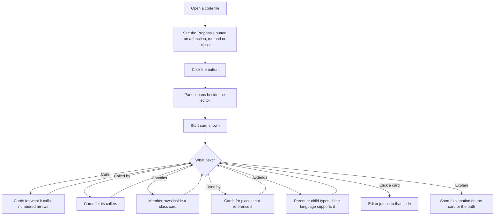

# Prophasis — Project Brief

**Version 1 (frozen once approved).** Later changes go into the "Changes" list in
`docs/PLAN.md` with a reason and a time cost.

Repository: https://github.com/hasnainbilash/prophasis

---

## 1. The problem

Code is spread across many files. To understand one function or class, a
developer jumps from file to file and keeps the chain in their head. VS Code
can show "who calls this" as a plain list, but a list doesn't show the shape of
the code, and it makes you read every file.

## 2. The idea

**Prophasis** is a VS Code extension. You click a button on a function, a
method or a class (the **starting point**). A panel opens and shows it as a
**card**. Related things appear as more cards joined by **arrows**: what it
calls, who calls it, what a class contains, where it is used, what it extends.
You **expand any card in any direction**, one step at a time, and click a card
to jump to its code.

It is a **flow and structure viewer** first. An optional layer explains a
function, a class, or a whole path of cards in plain language.

## 3. Users and roles

One role: **a developer using VS Code.** No accounts, no logins, no server.

Typical users: someone joining a new codebase, someone reviewing a pull
request, someone returning to an old project, a student learning how a
program fits together.

**Their 5 main jobs:**
1. See what a function or method calls, across files, without reading every file.
2. See who calls it, and where a class is used.
3. See what a class contains and what it extends.
4. Jump from any card to the exact line of code.
5. Get a short plain-language explanation of a function, a class, or a path.

**Project type:** both a portfolio / interview project and a real tool people
can install. **Deadline:** none, but "as fast as possible". **Budget:** free
tools only.

## 4. Goals

- Be useful on a real multi-file project in the first five minutes.
- Be honest about what it can't see (section 9 of `docs/PLAN.md`).
- Be fast: never freeze the editor, even on large projects.
- Be explainable in an interview: every part has a clear reason.

## 5. Features

### Must (version 1)
- A button on every function, method and class in the editor.
- A graph panel with cards and numbered arrows; works across files.
- Start from any function, method or class; expand from any card.
- Relationships: **calls**, **called by**, **contains** (class members),
  **used by**. **Extends / implements** where the language supports it.
- **Class cards** list their members as rows; call arrows leave from the exact
  member row.
- Click a card → editor jumps to that code.
- Arrows numbered in the order the calls appear in the code.
- Safe with loops and recursion; library code hidden by default.
- Card and node limits with a visible "N more not shown" card.
- Follows the VS Code theme (light, dark, high contrast).
- Clear messages for: no results, language not supported, language server still starting.

### Should
- Doc comment (JSDoc / docstring) shown on cards.
- **Explain** a function or a class (opt-in, needs consent).
- **Explain a path:** right-click a card → "Explain path from start to here".
- Search and filter in the graph; collapse a card; "pin" a card so it stays.
- Back and forward through earlier starting points.
- Export as PNG and as Mermaid text.
- Settings: depth, card limit, library code on/off, explanation provider.

### Later
- File-level arrows (file imports file); needs our own import reading.
- Flow inside a function (if / loop branches); needs our own parser.
- Variables and constants as starting points.
- Saving and sharing a graph.

### Not building
- A chat bot or "ask about my codebase" feature.
- A server, database, accounts, telemetry.
- Editing the user's code. Prophasis only reads.
- A perfect map of dynamic calls, callbacks or framework wiring.
- Support for other editors.

## 6. How we will know it's done

- On a real multi-file TypeScript project and a real Python project, clicking
  the button on a function, a method and a class shows correct cards and arrows,
  checked by hand against the source.
- Click-to-jump works for every card kind.
- A project with 1,000+ functions opens the panel and expands a card without
  freezing VS Code (measured, targets in `docs/PLAN.md`).
- Unit tests, integration tests in a real VS Code, and CI all pass.
- Published to the VS Code Marketplace, with a README that has a demo GIF,
  screenshots and an honest limitations section.

## 7. Where it fits among existing tools (research)

A few searches found these existing extensions. This is **not a full survey**.

| Tool (found) | What it does, per its own description |
|---|---|
| Chartographer | Call graph from VS Code's call hierarchy; groups functions by file; shows interface implementations; click a node to fetch its connections. |
| Code Visualizer (Ganjai Labs) | Right-click a function → flowchart of its call hierarchy; click nodes to go deeper. |
| CodeVisualizer (DucPhamNgoc08) | Function-level control-flow charts (own Tree-sitter parsing) plus a file-level dependency graph; optional AI labels. |
| Function Graph Overview | Control-flow graph of the current function. |

**So the basic idea "draw a call graph" is not new, and we should not claim it
is.** What I did not find in these tools, and what Prophasis is built around:

1. **Class cards with member rows**, so a class is one readable card and call
   arrows leave from the exact method.
2. **One canvas, many relationships** (calls, called by, contains, used by,
   extends) that you expand from any card.
3. **Numbered arrows** in call order, so a card reads like a short story.
4. **Explain a path of cards,** not just one function.
5. A polished, theme-native card design.

For interviews, the honest line is: "Existing tools draw call graphs; I built
this around class structure, multi-relationship exploration and path
explanation, and I can explain the language-server limits."

## 8. User flow

## 9. Screens

1. **Graph panel** (the main screen): toolbar and canvas of cards and arrows.
   Mockup: `docs/mockups/graph-panel.html`.
2. **Empty state:** "No calls found for this function." plus the likely reasons.
3. **Unsupported language:** "This language's extension doesn't provide call
   information. Try TypeScript, JavaScript or Python."
4. **Language server starting:** "The language server is still starting. Try
   again in a few seconds." with a Retry button.
5. **Too big:** "Showing 150 of 420 cards. Expand a card to see more."
6. **Explain consent notice:** says what will be sent and to which provider.

## 10. Visual direction (chosen in Phase 0)

You asked me to choose, so I chose **"native card"**: it looks like part of VS
Code and follows whatever theme the user has, rather than bringing its own
colours. It also avoids a whole class of dark/light/high-contrast bugs.

**Design rules**

| Rule | Value |
|---|---|
| Colours | Only VS Code theme variables (`--vscode-*`). No hard-coded colours except fallbacks in the mockup. |
| Card accent | A coloured left stripe by kind, from VS Code's symbol colours: function, method, class, interface. (Variable names to confirm in Phase 1.) |
| UI font | `--vscode-font-family`, 12–13 px |
| Code font | `--vscode-editor-font-family` for names and signatures |
| Spacing | 4 px scale: 4, 8, 12, 16, 24 |
| Corners | Cards 6 px radius |
| Card width | 240 px (function / method), 280 px (class) |
| Arrows | 1.5 px lines, arrowhead, round order badge (18 px) |
| Direction | Left to right: callers on the left, callees on the right |
| Motion | 150 ms ease on expand; none when the user prefers reduced motion |
| High contrast | Solid borders, no reliance on colour alone (kind is also shown as text/icon) |

## 11. Decisions made in Phase 0

| Topic | Decision | Reason |
|---|---|---|
| Name | Prophasis | Your choice |
| Language scope v1 | TypeScript / JavaScript and Python tested; others best effort | Honest and testable |
| Minimum VS Code | 1.90 | The Language Model API needs 1.90 or newer, per the VS Code docs |
| Button | CodeLens (main), plus title-bar icon, right-click menu, shortcut, and a gutter icon whose hover tooltip contains a "Show flow" link | Gutter icons themselves can't be clicked by extensions (section 3 of `docs/PLAN.md`) |
| New start while a panel is open | Replace the graph, keep a Back history; "Add to current graph" in the menu | Predictable default, power option available |
| Explain a path | Right-click a card → "Explain path from start to here" (shortest call path) | Simple to use, simple to build |
| File imports | Later | Not available from language servers |
| Licence | MIT | Common, simple, interview-friendly |
| Telemetry | None | Privacy; nothing to maintain |
