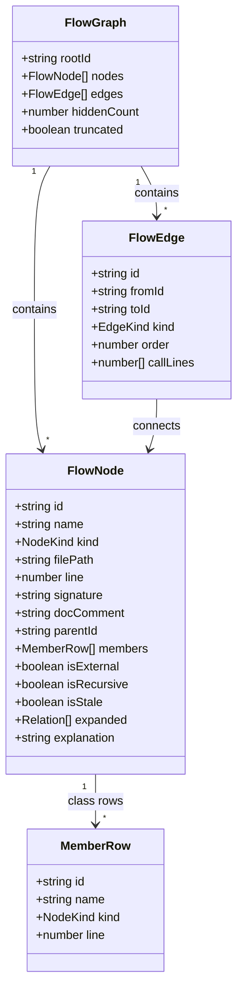
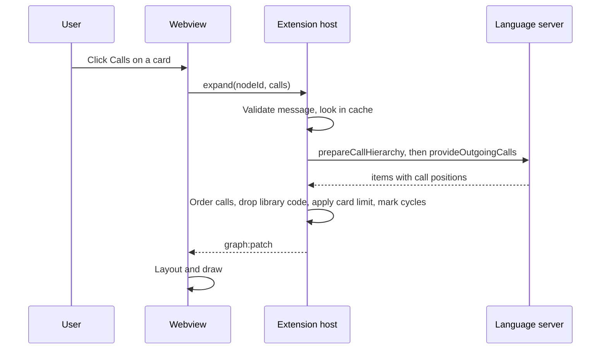

# Prophasis — Data Model

Prophasis has **no database**. Its data is a small graph kept in memory while a
panel is open, plus a cache and some settings. This file describes that graph,
the messages between the two halves of the extension, and the cache.

This is the expensive part to change later, so please review it carefully.

---

## 1. The graph

### Values

- **NodeKind:** `function`, `method`, `constructor`, `class`, `interface`,
  `struct`, `enum`.
- **EdgeKind:** `calls`, `calledBy`, `contains`, `usedBy`, `extends`,
  `implements`.
- **Relation** (the buttons on a card, remembered in `expanded`): `calls`,
  `calledBy`, `contains`, `usedBy`, `extends`.
- **MemberRow kind:** a `NodeKind` (method, constructor) or `field`. Fields are
  rows only; they never become cards.

### Field notes

| Field | Meaning and rules |
|---|---|
| `id` | `<file URI>#<kind>:<qualified name>@<start line>:<start column>`. The same symbol always gets the same id, so it can never appear as two cards. |
| `filePath` | Workspace-relative for display; the full URI is kept in the host only. |
| `signature` | One line, taken from the symbol's declaration text and cut at 120 characters. |
| `docComment` | First paragraph of the doc comment if the language server gives one, else empty. |
| `parentId` | For a method: the id of its class card, so arrows can start from a member row. |
| `members` | Only on class-like cards: one row per method, constructor or field. Rows cap at 40; `hiddenMembers` holds the rest for the "+N more" row. |
| `isExternal` | The symbol lives outside the workspace folders (library, standard library). Hidden unless the setting allows it. |
| `isRecursive` | A call cycle returns to this node; shown as a marker instead of drawing an endless loop. |
| `isStale` | The file changed after this card was built. The card shows a small "code changed" mark and a refresh button. |
| `order` | Arrow number: the position of the call inside the caller's body, counted by source position. This is **textual order, not run-time order**. |
| `callLines` | Every line in the caller where this call happens. Two calls to the same function make one edge with two lines, not two edges. |
| `calledBy` edges | Found through "Called by". They point the same way as `calls` (caller → callee) but have `order` 0, because the caller's other calls aren't loaded. If the caller's calls are loaded later, the edge becomes a numbered `calls` edge. There is only ever one edge per caller/callee pair. |
| `explanation` | Text from the Explain feature. Never stored on disk. |

### Rules the code must keep

1. A graph never contains two nodes with the same `id`.
2. Every edge points at nodes that exist in the graph.
3. `contains` edges only connect a class-like node to its own members.
4. A `calls` edge from a member row uses the member's id as `fromId`.
5. The graph never has more than `maxCards` nodes (default 150); extra items
   are counted in `hiddenCount` and shown as one summary card.
6. Nothing in the graph is written to disk, except what the cache holds.

---

## 2. Messages between the extension host and the panel

The **extension host** (runs in VS Code) finds code and builds the graph. The
**webview** (the panel) only draws it. They talk with messages; every message is
checked with Zod when it arrives, in both directions.

### Webview → host

| Message | Payload | What the host does |
|---|---|---|
| `ready` | none | Sends `graph:init` for the current start symbol. |
| `expand` | `nodeId`, `relation` | Loads that relationship one level deep, sends `graph:patch`. |
| `collapse` | `nodeId`, `relation` | Sends `graph:patch` removing the nodes only reachable through it. |
| `reveal` | `nodeId` | Opens the file and selects the symbol in the editor. |
| `explain` | `nodeId` or `pathNodeIds` | Checks consent, calls the explain provider, sends `explain:result`. |
| `refresh` | `nodeId` | Rebuilds a stale card. |
| `export` | `format` (`mermaid`) | Copies the Mermaid text. |
| `back` / `forward` | none | Moves through earlier starting points. |

### Host → webview

| Message | Payload |
|---|---|
| `graph:init` | a full `FlowGraph` |
| `graph:patch` | nodes and edges to add (an edge with an existing id replaces it), nodes whose fields changed (`updateNodes`, e.g. `expanded` or `isRecursive`), ids to remove, new `hiddenCount` |
| `explain:result` | `nodeId` or `pathNodeIds`, text, or an error code |
| `status` | `loading`, `languageServerStarting`, `unsupported`, `empty`, or an error message |
| `theme` | not needed: the webview reads VS Code's CSS variables directly |

### Expanding a card

Each request to a language server has a **5 second timeout** and is cancelled if
the panel closes.

---

## 3. Where each relationship comes from

| EdgeKind | VS Code built-in command | Status |
|---|---|---|
| `calls` | `vscode.prepareCallHierarchy` + `vscode.provideOutgoingCalls` | Command names found in the official docs |
| `calledBy` | `vscode.prepareCallHierarchy` + `vscode.provideIncomingCalls` | Command names found in the official docs |
| `contains` | `vscode.executeDocumentSymbolProvider` | Command name found in the official docs |
| `usedBy` | `vscode.executeReferenceProvider`, each location mapped to its enclosing symbol using document symbols | Command name found in the official docs; the mapping is our code |
| `implements` (children) | `vscode.executeImplementationProvider` | Command name found in the official docs |
| `extends` / `implements` (parents) | Type hierarchy provider | **Unverified.** The provider interface exists in the extension API, but I did not confirm the command to *read* it from an extension. Phase 1 tests it. If it fails, this button is hidden. |

"Found in the official docs" means the command is listed there. It does **not**
mean every language answers it correctly. That is tested per language in Phase 1.

---

## 4. Cache

- **Where:** memory only, per VS Code window.
- **Key:** `symbol id + relation + file version`. A saved or edited file has a
  new version, so its old entries are never used.
- **Size:** at most 500 entries; oldest removed first.
- **Explanations:** cached by a hash of the exact code sent, so a function is
  explained at most once until its code changes. Cleared when VS Code closes.

---

## 5. Settings (all optional, shown in VS Code's Settings page)

| Setting | Default | Meaning |
|---|---|---|
| `prophasis.defaultDepth` | 1 | Levels loaded on first open. 1 means the start card plus what it directly calls (for a class: its members). The user expands from there. |
| `prophasis.maxCards` | 150 | Cards on screen before the "N more" summary. |
| `prophasis.showExternalCode` | false | Show library and standard-library symbols. |
| `prophasis.excludeGlobs` | empty | File patterns to hide from the graph (for example test folders). |
| `prophasis.explain.includeBodies` | false | For "Explain this class": include method bodies, not only signatures. |
| `prophasis.explain.maxCharacters` | 12000 | Hard cap on code sent in one request. |

Explain uses VS Code's Language Model API only. A provider using the user's
own API key is planned for later; when added, the key goes in VS Code's
SecretStorage, never in a setting.
