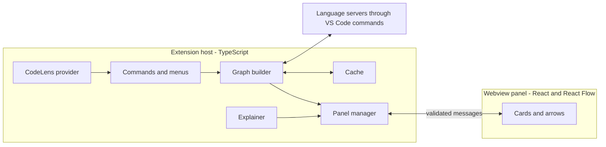

# Prophasis — Plan

Goal: a VS Code extension that shows how code connects, as cards and arrows,
starting from any function, method or class. Full details: `docs/BRIEF.md`.
Data and messages: `docs/DATA_MODEL.md`.

---

## 1. Goal in short

Click a button on a function, method or class. See it as a card. Expand
related cards in any direction (calls, called by, contains, used by, extends).
Click a card to jump to its code. Optionally get a plain-language explanation
of a card or a path of cards.

---

## 2. Tech stack (approved)

Your default web-app stack mostly doesn't apply: an extension has no server, no
database and no login. This is the stack for Prophasis.

| Part | Choice | Why | Cost |
|---|---|---|---|
| Language | TypeScript (strict) | Same language for the extension and the panel | Free |
| Extension side | VS Code Extension API, esbuild bundle | The official way; esbuild is fast | Free |
| Panel (webview) | React + TypeScript, plain CSS using `--vscode-*` theme variables | Matches every theme with no extra setup | Free |
| Graph drawing | React Flow + dagre (automatic left-to-right layout) | Cards, arrows, zoom, drag. Building this ourselves would take weeks. `elkjs` is the swap-in if dagre layouts look poor. | Free |
| Message checking | Zod | Every message between host and panel is validated | Free |
| Unit tests | Vitest | Graph logic runs fast without VS Code | Free |
| Integration tests | `@vscode/test-cli` + `@vscode/test-electron` | Runs tests inside a real VS Code | Free |
| CI | GitHub Actions | Lint, type check, tests, build, package on every push | Free |
| Packaging and publishing | `vsce`, VS Code Marketplace (and Open VSX) | Where extensions live | Free |
| Lint / format | ESLint + Prettier | Consistency | Free |
| Explanations | Provider interface: VS Code's Language Model API, or the user's own key in SecretStorage | Swappable, no key for us to manage | Costs belong to the user's own model access |

Not used, on purpose: Next.js, Tailwind, PostgreSQL, Prisma, Auth.js, Vercel,
Vercel Cron, Playwright, Redis, queues. None has a reason here.

`.env.example` is not needed: there are no environment variables. Every setting
is documented in `docs/DATA_MODEL.md` and the README.

Before publishing I will check the licences of React Flow, dagre and every other
dependency. I believe they are permissive, but that is not yet confirmed.

---

## 3. What I verified in Phase 0, and what I did not

**Verified by reading official documentation or primary sources** (not by running code):

| Finding | Source |
|---|---|
| Built-in commands exist for call hierarchy (`prepareCallHierarchy`, `provideIncomingCalls`, `provideOutgoingCalls`), document symbols, references, definition and implementation providers | VS Code's built-in commands page |
| The Language Model API shows a consent dialog on first use, must be called from a user action, and can be refused because of quota limits | VS Code's API documentation |
| The Language Model API needs VS Code 1.90 or newer | VS Code's Language Model guide |
| Extensions cannot receive click events on the editor gutter. This is an open feature request in VS Code's issue tracker. A workaround: a gutter icon with a hover message that contains a command link (two steps: hover, then click). **Phase 1: this workaround does not work; see 3.1.** | VS Code issue #5455 |
| Python: Pylance and Pyrefly both document call hierarchy support; Pylance's issue list mentions type hierarchy | Pylance release notes and issues, Pyrefly docs |
| Python call hierarchy misses indirect calls (for example through `functools.partial`) | A user report in the Pylance discussions |
| Outgoing call lists can include library code (a feature request asks to tell workspace and library symbols apart) | Pylance release notes |
| Building a code graph this way is feasible | A public tutorial builds one with these commands, and Chartographer and Code Visualizer already ship this approach |

**Still not verified:**

- All performance numbers in section 5. They are targets, not measurements
  (the fixture calls below are tiny and say nothing about large projects).
- The current Marketplace publishing steps (they change; I'll check when we get there).
- Behaviour in VS Code on the web, Remote-SSH, WSL and Dev Containers.
- Languages other than TypeScript, JavaScript and Python.

### 3.1 Phase 1 feasibility results (measured)

**How:** `npm run probe` starts a separate copy of VS Code with the extension
loaded, opens `test/fixtures/fixtures.code-workspace` (small TypeScript,
JavaScript and Python projects) and calls each command on 21 chosen symbols.
Raw answers go to `.vscode-test/results/probe-<version>.json`; I compared them
by hand with the fixture source.

**Setup:** VS Code 1.140.0 with its built-in TypeScript support, Python
extension 2026.8.0 and Pylance 2026.4.1 (no Python interpreter installed).
TypeScript and JavaScript were also run on VS Code 1.90.0, the minimum
version, with the same answers.

| Question (command) | TypeScript | JavaScript | Python (Pylance) |
|---|---|---|---|
| Symbols in a file (`executeDocumentSymbolProvider`) | Works: tree with classes, methods, constructors | Works | Works |
| Calls (`prepareCallHierarchy` + `provideOutgoingCalls`) | Works across files, with call positions | Works | Works |
| Called by (`provideIncomingCalls`) | Works across files | Works | Works |
| Recursion and mutual recursion | Shown as a call to itself / to each other | Shown | Shown |
| Used by (`executeReferenceProvider`) | Works; includes the declaration and import lines | Works | Works |
| Implementations (`executeImplementationProvider`) | Works for interfaces and methods; includes the symbol itself | Works (class and subclass) | Works |
| Parents / children (`prepareTypeHierarchy` + `provideSupertypes` / `provideSubtypes`) | **Not supported:** the command exists but returns nothing | **Not supported** | **Works** both ways, including standard-library parents |
| Call hierarchy on an interface | Returns nothing (interfaces can't be called) | n/a | Returns the class (no calls) |

**Details that matter for Phase 2:**

1. **Library code is included** in outgoing calls (`JSON.stringify`,
   `Math.max` from `lib.es5.d.ts`; `len`, `json.dumps`, `ValueError` from
   typeshed). Its location is outside the workspace folders, so the planned
   `isExternal` rule works for all three languages.
2. **Duplicate call positions:** for `this.x()` calls, TypeScript and
   Pylance sometimes report the same position twice. They must be removed
   before building `callLines` and `order`.
3. **Implementations include the symbol itself.** It must be filtered out.
4. **Calls through an interface** point at the interface method, not at the
   class that implements it (confirmed; already listed in section 9).
5. **Creating an object counts as a call to the class:** `new OrderService()`
   (TypeScript) and `OrderService()` (Python) appear as calls to the class,
   and `super()` as a call to the parent class.
6. **Pylance is not always consistent about kind:** the same method came back
   as `Method` in one answer and `Function` in another. The node id must not
   depend on the reported kind alone.
7. **"Still starting" looks like "nothing here":** while a language server
   starts, the file's symbols come back as an empty list, not an error.
   Measured time until the first real answer, from opening the first file:
   TypeScript about 3.8 s, Python about 8.6 to 10 s.
8. **Speed on the fixtures:** every single command answered in under 50 ms
   once the language server was ready.

**Decisions this confirms (no change to the frozen design):**

- Extends (parents) is offered only where type hierarchy works: Python yes,
  TypeScript and JavaScript no. For TypeScript and JavaScript, children
  (implementations and subclasses) come from the implementation provider, as
  planned.
- The "language server starting" state is needed and is triggered by empty
  answers shortly after a file opens.

**Theme colours:** VS Code defines `--vscode-symbolIcon-functionForeground`,
`-methodForeground`, `-constructorForeground`, `-classForeground`,
`-interfaceForeground`, `-structForeground`, `-enumeratorForeground` and 30 more
(read from a real webview). In the default dark theme, function, method and
constructor share **one colour**, so the stripe alone can't tell a function from
a method. The card's kind label does (already a design rule for high contrast).

**Gutter icon hover link: does not work.** Tested by hand in the Extension
Development Host: hovering the icon shows nothing. The reason, found in VS Code
1.140's own code: the gutter hover only reads a decoration field
(`glyphMarginHoverMessage`) that VS Code's breakpoints and test icons use, and
the extension API never sets it. An extension's `hoverMessage` only shows when
hovering the code text. The gutter icon was removed (see Changes).

**Test harness note:** the "Python Environments" extension closed the test
window on a machine with no Python installed. Code analysis doesn't need it, so
the probe turns it off.

---

## 4. Architecture



Planned folders:

```
src/
  extension/   activation, CodeLens, commands, graph builder, cache, explainer
  webview/     React app: cards, edges, toolbar, states
  shared/      types and Zod message schemas used by both sides
test/
  unit/        Vitest
  integration/ tests run inside VS Code
  fixtures/    small TypeScript and Python sample projects
docs/          BRIEF, DATA_MODEL, PLAN, mockups
```

Design rules for the code:

- **The host builds the graph; the panel only draws it.** The panel never reads files.
- **Do nothing at startup.** Activation only registers the CodeLens provider and
  commands. No workspace scanning.
- **CodeLens is cheap:** it uses document symbols, cached per document version,
  and never calls the call hierarchy until a button is clicked.
- **Everything is cancellable** and has a 5 second timeout.
- The explain provider sits behind one small interface so it can be swapped.

---

## 5. Performance targets (to be measured, not yet true)

| Action | Target |
|---|---|
| Extension activation | under 200 ms, no workspace scan |
| First open on a project with about 1,000 functions, language server ready | under 1.5 s |
| Expanding one card | under 1 s typical |
| Layout of 150 cards | under 300 ms |
| Large fan-out (a function with 100 callees) | grouped into one "N more" card, not 100 cards |

Phase 4 measures these on a generated project and on a real open-source
project, before and after any optimisation.

---

## 6. Testing

- **Unit (Vitest), with a fake call-hierarchy provider:** graph building, cycle
  detection, call-order numbering, id creation, limits, stale marking, message validation.
- **Integration, in a real VS Code, on the sample projects:** exact expected
  cards and edges for TypeScript and Python; click-to-jump lands on the right
  line; class cards show the right members.
- **Manual, by you,** after every phase, with numbered click-by-click steps in
  the chat.
- **Real-project check:** one open-source TypeScript project and one Python
  project, compared by hand against the source.
- **CI** on every push: lint, type check, unit tests, build, integration tests
  (virtual display), package the `.vsix`.
- Tests that need a language model use an offline fake.

---

## 7. Security and privacy

- Webview: strict Content-Security-Policy with a per-load nonce, no remote
  scripts, no inline handlers, only local resources.
- Names and code from the user's project are rendered as plain text, never as HTML.
- All messages validated with Zod in both directions.
- No network in the core extension. Only Explain talks to a model, and only
  after consent, and only with the selected code, capped by `explain.maxCharacters`.
- A user's API key lives in SecretStorage, never in settings, logs or the repo.
- Prophasis never edits the user's files.
- No telemetry.
- Dependency audit on every release; accepted risks written down with the reason.
- Workspace Trust: in an untrusted workspace, Explain is disabled.

---

## 8. Phases

Times are build-and-verify time. Add about 20–30 minutes of your own manual
testing per phase. Each phase follows your cycle: plan → build → verify myself →
commit locally → report → you test → your green signal → squash and push.

**The fast route:** a usable version (functions, methods, classes, calls,
called by, click-to-jump) exists at the end of **Phase 3, about 12 hours of
build time.** Everything after that adds depth and polish.

### Phase 1: Setup and feasibility check (about 2.5 hours)
- [ ] Extension scaffold: TypeScript strict, esbuild, ESLint, Prettier, LICENSE (MIT)
- [ ] Repo-local git config with your name and email
- [ ] CodeLens button on functions, methods and classes (using document symbols)
- [ ] One command that opens an empty panel
- [ ] **Feasibility check, run in a real VS Code on the fixture projects:** call hierarchy (both directions), document symbols, references, implementation and type hierarchy, for TypeScript, JavaScript and Python. Record results in a table in this file (section 3).
- [ ] Confirm the gutter icon + hover-link workaround works (result: it does not; see section 3.1 and Changes)
- [ ] Confirm `--vscode-symbolIcon-*` variable names
- [ ] GitHub Actions CI (lint, type check, build) and README skeleton

### Phase 2: The graph engine (about 4–5 hours)
- [ ] Symbol at the click position (function, method, class)
- [ ] Document symbols: class → members
- [ ] Outgoing calls across files, with call positions
- [ ] Order numbering, cycle detection, library filtering, card limit, `hiddenCount`
- [ ] Cache with file-version keys; 5 second timeout; cancellation
- [ ] Unit tests with a fake provider

### Phase 3: Cards and arrows (about 5 hours) — usable version
- [ ] Webview with React Flow and dagre, left-to-right layout
- [ ] Function card and class card with member rows; arrows leave from rows
- [ ] Numbered arrows, kind accent stripe, theme variables, high-contrast check
- [ ] Click to jump, expand, collapse, zoom to fit
- [ ] Called by (incoming calls)
- [ ] Zod-validated messages, webview CSP
- [ ] Empty, unsupported-language and "language server starting" states
- [ ] Integration tests on the fixtures

### Phase 4: More relationships and scale (about 4 hours)
- [ ] Used by (references mapped to the enclosing symbol)
- [ ] Extends / implements, only for languages where Phase 1 showed it works
- [ ] Search, Back / Forward history
- [ ] "N more not shown" card and large fan-out grouping
- [ ] Measure the section 5 targets on a generated and a real project; fix what misses

### Phase 5: Explanations (about 4.5 hours)
- [ ] Doc comments on cards
- [ ] Provider interface, consent notice, cache by code hash, size cap
- [ ] Providers: VS Code's Language Model API; the user's own key in SecretStorage
- [ ] Explain a function, explain a class, **explain a path** (start → selected card)
- [ ] Offline fake model for tests; spot-check with a real model before reporting
- [ ] Before starting: re-read the Language Model API docs for current limits

### Phase 6: Polish (about 1.5–2 hours)
- [ ] Right-click menu, shortcut
- [ ] Export Mermaid
- [ ] Keyboard navigation inside the graph, contrast, screen-reader labels
- [ ] Fixes and wording from your testing

### Phase 7: Production hardening and release (about 3–4 hours)
- [ ] Security checklist, dependency audit, licence check, structured error logging
- [ ] Test and coverage review
- [ ] CI release workflow that builds the `.vsix` from a version tag
- [ ] README: pitch, demo GIF, screenshots, features, limitations, settings, getting started, CI badge
- [ ] Marketplace publisher setup, click by click; first publish **only after your OK**
- [ ] Interview prep: likely questions with short answers; CV bullets using only true numbers

**Total:** about 28–35 hours of build time over several sessions. These are
estimates; Phase 1 will show how far off they are.

---

## 9. Honest limits (these go in the README)

- **It shows what the language server knows.** Dynamic calls (`handlers[name]()`),
  callbacks passed around, `eval`, reflection, dependency injection, decorators,
  event buses and framework wiring are often invisible.
- **Interfaces:** a call to an interface method may point at the interface, not
  at the implementation that really runs.
- **Arrow numbers are textual order,** not run-time order. A call inside an `if`
  may never run.
- **"Used by"** can't tell `new Foo()` from a type annotation.
- **Quality depends on the language extension.** A language without call
  hierarchy support gets a clear "not supported" message.
- **Explanations can be wrong.** They are labelled as generated and are based
  only on the code that was sent.
- File-level import arrows and flow inside a function are not in version 1.

---

## 10. Risks

| Risk | Effect | What we do |
|---|---|---|
| Call hierarchy results are poor in some language | Empty or wrong graph | Phase 1 check; clear unsupported message; document per language |
| Language server still indexing | "No results" that is really "not ready" | Detect empty-while-starting, show the starting state with Retry |
| Large codebase | Slow or unreadable graph | Lazy loading, limits, caching, grouping, measured targets |
| Language Model API unavailable or over quota | No explanations | Second provider (own key); the core viewer works without it |
| Existing tools already draw call graphs | Looks like a copy | Be honest in the README; lead with class cards, multi-relationship exploration and path explanation |
| Marketplace publisher account setup takes time | Delays the release | Start the account in Phase 6, not Phase 7 |
| Webview CSP or bundling problems | Blank panel | Solve in Phase 1/3, test in CI |

---

## 11. Decisions, including what we decided against

| Decision | Why |
|---|---|
| Use the language servers' commands, not our own parser | A fraction of the work; works across languages. Own parser is **not worth it yet**; it becomes worth it for file-level imports and flow inside a function. |
| CodeLens as the main button | Standard and clickable. Gutter icons can't take clicks or show an extension's hover, so there is no gutter icon (Phase 1 result). |
| No database, server, accounts or telemetry | Nothing to store or protect |
| Load one level at a time | Keeps large codebases fast |
| Explanations opt-in and after the viewer works | Privacy, cost, schedule |
| Plain CSS with VS Code theme variables, no Tailwind | Looks native in every theme |
| One package, not a monorepo | One extension, one panel; a monorepo adds setup for no gain |
| Replace the graph on a new start, with Back history | Predictable; "Add to current graph" moved to Later |
| Minimum VS Code 1.90 | The Language Model API needs it |

---

## 12. Changes (after version 1 is frozen)

| Date | Change | Why | Time effect | Approved |
|---|---|---|---|---|
| 2026-10-07 | Removed the gutter icon with a "Show flow" hover link. Entry points are now CodeLens, right-click menu and shortcut. | Phase 1 showed extensions can't give a gutter icon a hover (section 3.1), so the icon could not be clicked or hovered. | Saves about 15 min in Phase 6 | Owner, 2026-10-07 |
| 2026-10-07 | PNG export moved to Later; Mermaid export stays. | A screenshot does the same job; PNG export from a webview needs an extra library and a save dialog. Mermaid text is the useful export (pastes into GitHub, docs, PRs). | Saves about 45 min in Phase 6 | Owner gave a standing OK to cut low-value items, 2026-10-07 |
| 2026-10-07 | "Pin a card" and "filter" moved to Later; search stays. | With one level loaded at a time and collapse available, pin and filter add little. Search is what helps in a big graph. | Saves about 45 min in Phase 4 | Same standing OK |
| 2026-10-07 | "Add to current graph" moved to Later. | A power option nobody has asked for; Back history covers going between starting points. | Saves about 30 min | Same standing OK |
| 2026-10-07 | Title-bar icon removed. | CodeLens, right-click menu, shortcut and Command Palette already cover every way to start; a fifth button is clutter. | Saves about 10 min in Phase 6 | Same standing OK |
| 2026-10-07 | Our own rate limit on Explain removed. | Explain runs only on a click, results are cached by code hash, and VS Code's Language Model API enforces its own quota with a clear error. A second limit protects nothing. | Saves about 20 min in Phase 5 | Same standing OK |

---

## 13. Git and release rules

- Push straight to `main`. No feature branches, no pull requests.
- One squashed commit per phase; push only after your explicit green signal.
- Commits use your name and email (repo-local config).
- No force-push or history rewriting on pushed commits.
- Releases come from a version tag. The Marketplace token is stored as a GitHub
  Actions secret that **you** add in the dashboard; it is never pasted into chat.

---

## 14. What to be ready to explain in an interview

- Why the language servers' commands instead of a parser, and what that can't see.
- How the extension host and the panel are separated, and why every message is validated.
- How recursion and loops are handled, and how large graphs stay fast
  (lazy loading, limits, caching, grouping, timeouts, cancellation).
- Why arrow numbers are textual order, not run-time order.
- How Explain protects privacy: opt-in, only the selected code, a size cap,
  consent, no key in settings.
- How Prophasis differs from existing tools, said honestly.
